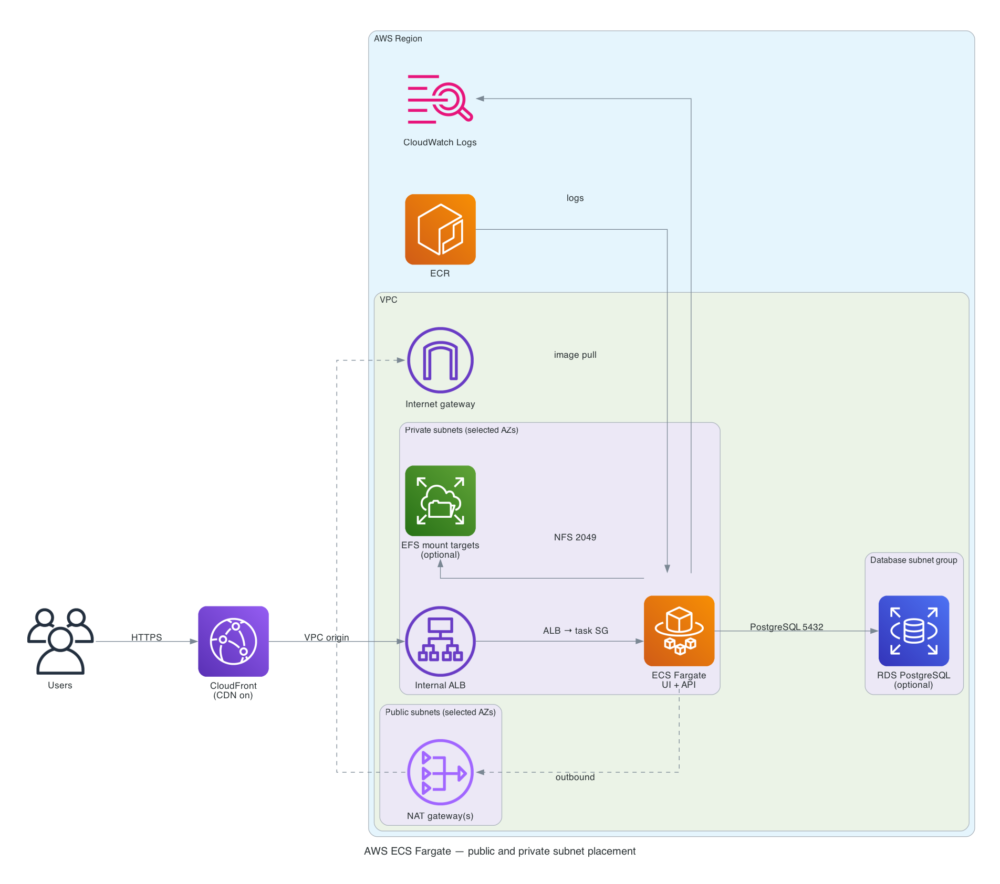

# AWS ECS Fargate Terraform starter

A ready-to-fork Terraform stack for deploying a containerized web application
to AWS ECS Fargate. The defaults discover Availability Zones in your selected
region and launch a working nginx container, so you can verify the platform
before publishing your own image.



## What this starter creates

- A VPC across two or more automatically discovered Availability Zones
- Public subnets for a directly exposed ALB, or private ALB subnets when
  CloudFront is enabled
- Private subnets for ECS tasks and database subnets for optional RDS
- One cost-saving NAT Gateway by default, or one per AZ for production
- An ECS Fargate cluster, service, task definition, rolling deployments, and
  CPU/memory autoscaling
- An ECR repository with immutable tags, push scanning, and lifecycle cleanup
- CloudWatch container logs with configurable retention
- Least-privilege network paths between the ALB, ECS, optional EFS, and optional
  PostgreSQL
- Optional CloudFront with a private VPC origin, encrypted EFS, and RDS
  PostgreSQL

The starter intentionally does not create DNS records, an ACM certificate, an
application-image deployment pipeline, or application-specific IAM permissions.
Those choices depend on your domain, deployment platform, and application.

## Requirements

| Requirement | Supported version or notes |
|---|---|
| Terraform | `>= 1.11.1, < 2.0.0` |
| AWS CLI | v2 |
| Docker | Required only to build and push your own image |
| AWS account | Credentials with permission to create the resources above |

The configuration uses AWS provider `>= 6.46, < 7.0`. The committed lock file
currently selects `6.56.0`.

### Pinned module versions

These were the latest releases in the Terraform Registry on 24 July 2026:

| Module | Version |
|---|---:|
| [`terraform-aws-modules/vpc/aws`](https://registry.terraform.io/modules/terraform-aws-modules/vpc/aws/latest) | `6.6.1` |
| [`terraform-aws-modules/alb/aws`](https://registry.terraform.io/modules/terraform-aws-modules/alb/aws/latest) | `10.5.0` |
| [`terraform-aws-modules/ecs/aws`](https://registry.terraform.io/modules/terraform-aws-modules/ecs/aws/latest) (cluster + service) | `7.5.0` |
| [`terraform-aws-modules/rds/aws`](https://registry.terraform.io/modules/terraform-aws-modules/rds/aws/latest) | `7.2.0` |
| [`terraform-aws-modules/cloudfront/aws`](https://registry.terraform.io/modules/terraform-aws-modules/cloudfront/aws/latest) | `6.7.0` |
| [`terraform-aws-modules/security-group/aws`](https://registry.terraform.io/modules/terraform-aws-modules/security-group/aws/latest) | `6.0.0` |

Modules are pinned because Terraform does not record module selections in the
provider lock file. Dependabot proposes updates for review.

### Reuse decisions

The repository uses official modules where they remove substantial infrastructure
code, and keeps direct resources where a module would add more surface area than
value:

| Capability | Decision |
|---|---|
| VPC, ALB, ECS cluster/service, RDS, CloudFront, security groups | Reuse the pinned `terraform-aws-modules` implementation |
| ECR repository | Keep two direct resources; consider [`ecr/aws` `3.2.0`](https://registry.terraform.io/modules/terraform-aws-modules/ecr/aws/latest) for cross-account policies, enhanced scanning, pull-through cache, or replication |
| EFS file system | Keep the small opt-in setup; consider [`efs/aws` `2.2.0`](https://registry.terraform.io/modules/terraform-aws-modules/efs/aws/latest) for access points, lifecycle policies, replication, or file-system policies |
| CloudWatch log group | Let the official ECS service module manage it with the container definition |
| ACM and Route53 | Keep external because domain ownership and DNS delegation are organization-specific |
| Remote-state S3 bucket | Bootstrap separately; a backend cannot safely create the bucket that stores its own state |

The official ECS service module replaced the repository's local ECS module. It
now owns the service, task definition, autoscaling, logging, and task/execution
IAM roles.

## Start a new project

Use the repository as a GitHub template so your project gets a clean history
and its own remote:

1. Select **Use this template** on GitHub.
2. Create a repository in your account or organization.
3. Clone that new repository.

Or use the GitHub CLI:

```bash
gh repo create my-project-infrastructure \
  --template d2k-klin/terraform-aws-ecs-fargate \
  --clone
cd my-project-infrastructure

cp example.tfvars terraform.tfvars
# Edit name, aws_region, and tags in terraform.tfvars.

aws sts get-caller-identity
terraform init
terraform fmt -check -recursive
terraform validate
terraform plan -out=out.plan
terraform apply out.plan

terraform output -raw application_url
```

Clone this repository directly only when contributing changes back to the
starter itself.

The first apply runs `public.ecr.aws/docker/library/nginx:alpine` on port `80`
with `/` as its health check. This avoids the ECR bootstrap problem: the
repository must exist before you can push your application image.

## Deploy your application

After the first apply:

```bash
AWS_REGION="eu-west-1" # Must match aws_region in terraform.tfvars.
ECR_URL="$(terraform output -raw ecr_repository_url)"
ECR_REGISTRY="${ECR_URL%/*}"
IMAGE_TAG="v1"

aws ecr get-login-password --region "$AWS_REGION" \
  | docker login --username AWS --password-stdin "$ECR_REGISTRY"

docker build -t "$ECR_URL:$IMAGE_TAG" .
docker push "$ECR_URL:$IMAGE_TAG"
```

Set the complete image URL and your application's port and health path:

```hcl
container_image   = "<AWS_ACCOUNT_ID>.dkr.ecr.eu-west-1.amazonaws.com/myapp-dev:v1"
container_port    = 3000
health_check_path = "/health"
```

Then deploy the new task definition:

```bash
terraform plan -out=out.plan
terraform apply out.plan
```

ECR tags are immutable. Use a unique tag such as a Git commit SHA for every
release instead of reusing `latest`.

## Common settings

| Variable | Default | Purpose |
|---|---|---|
| `name` | `app` | Short project name |
| `environment` | `dev` | Environment label |
| `aws_region` | `us-east-1` | AWS deployment region |
| `availability_zone_count` | `2` | Number of automatically selected AZs |
| `single_nat_gateway` | `true` | Lower cost; set `false` for AZ resilience |
| `container_image` | public nginx | Complete image reference |
| `container_port` | `80` | Application listener port |
| `service_desired_count` | `1` | Initial number of tasks |
| `use_fargate_spot` | `true` | Lower cost, but tasks may be interrupted |
| `create_cdn` | `false` | Add CloudFront and make the ALB private |
| `create_efs` | `false` | Add shared persistent storage |
| `create_postgresql` | `false` | Add RDS PostgreSQL |
| `certificate_arn` | `null` | Enable direct ALB HTTPS when the CDN is off |
| `tags` | `{}` | Organization, owner, and cost-allocation tags |

See [variables.tf](variables.tf) for every input and validation rule.

## Cost and production defaults

This repository starts in a cost-conscious development mode. NAT Gateway, ALB,
Fargate, CloudFront, EFS, RDS, data transfer, and logs can all incur charges.
Run `terraform destroy` when an experiment is finished.

Before production, normally set:

```hcl
single_nat_gateway    = false
use_fargate_spot      = false
service_desired_count = 2
autoscaling_min_capacity = 2
create_cdn            = true
```

Also configure HTTPS, remote state, backups appropriate to your recovery
objectives, monitoring/alerts, and narrowly scoped task IAM policies.

When `create_cdn = true`, CloudFront uses an AWS-managed VPC origin to reach an
internal ALB in private subnets. The ALB security group accepts origin traffic
only from the AWS-managed CloudFront prefix list, so clients cannot bypass
CloudFront. One default behavior forwards every HTTP method, header, cookie,
and query string with caching disabled; a single container can therefore serve
both its UI and API without separate origins or path rules.

## Documentation

The [developer user guide](docs/USER_GUIDE.md) covers:

- prerequisites and AWS authentication
- configuration and first deployment
- building and releasing images
- environment variables, secrets, and IAM
- CloudFront, HTTPS, EFS, and PostgreSQL
- remote state and team workflows
- production readiness, upgrades, troubleshooting, and cleanup

## Validate changes

```bash
terraform fmt -check -recursive
terraform init -backend=false
terraform validate
terraform test
python3 -m pip install --requirement scripts/requirements.txt
python3 scripts/generate_diagram.py --selfcheck
```

GitHub Actions runs the Terraform checks on pull requests. Dependabot checks
Terraform modules/providers and GitHub Actions weekly. Gitleaks scans the full
Git history on every pull request, push to `main`, and release.

## Contributions and releases

`main` is protected. The repository owner may push directly; all other
contributors must open a pull request, pass the `validate` and `gitleaks`
checks, receive the code owner's approval, and resolve review conversations.

Semantic version tags publish releases after repeating validation and secret
scanning:

```bash
git tag -a v1.2.3 -m "v1.2.3"
git push origin v1.2.3
```

See [SECURITY.md](SECURITY.md) for vulnerability reporting and secret-handling
rules.

## License

[MIT](LICENSE)
